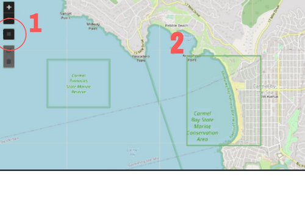

# How to Download Imagery

## Steps to Download Imagery

**1.Activate the Notebook:**

```
conda activate coastseg
jupyter lab SDS_coastsat_classifier.ipynb
```

**2.Set the ROI Area**

- Recommend ROI area: 20km² - 30km²
- **For Non-overlapping ROIs**: Set `Small ROI Area` to 0 and `Large ROI Area` to the desired ROI area.
- **For Overlapping ROIs**: Assign a value to `Small ROI Area` and set `Large ROI Area` to the desired ROI area.

**3.Define the Bounding Box:**

- Use the rectangle tool (located on the map's right-hand corner) to draw a bounding box around your desired area.
- Ensure the bounding box isn't excessively large, or it will be removed.
- Before generating ROIs, click the `load shorelines` button to verify the presence of shorelines within the bounding box.
  - ⚠️ If no shorelines are detected, ROIs can't be created. Consider uploading your shorelines using a geojson file.
  - Additionally, check for any transects within your bounding box. If none are present, upload your transects via a geojson file.



**4.Generate ROIs:**

- Click the `Generate ROIs` button. This action creates a grid of ROIs along the shoreline within the bounding box.

- If you want to use your own custom ROIs follow the tutorial [How to Create ROIs](https://satelliteshorelines.github.io/CoastSeg/How-to-Create-Reference-Shorelines-%26-Transects%26ROIs/) and [How to Upload Features](https://satelliteshorelines.github.io/CoastSeg/how-to-upload-features/)

**5.Select Desired ROIs:**

- After the ROIs appear on the map, select those for which you want to download satellite imagery.

**6.Preview the Imagery Available**

- This will show the number of images available for each ROI for each satellite selected across the selected date range


**7.Download Imagery:**

- Click `Download Imagery`. The imagery for the chosen ROIs (highlighted in blue) will be downloaded.

- NEVER rename your ROIs this is because CoastSeg keeps track of the filename in the 'config.json' and you won't be able to load it into CoastSeg again if you do. The ROI's ID is the filename so that information will be lost if you rename it.


**8.Examine the Download Report (Optional)**

- Inside of Coastseg/data for each ROI you download there is a 'download_report.txt' file for each time the ROI was downloaded

- When you open the file it will list which files downloaded successfully as well as any interruptions to the download process


## Understanding ROI (Region of Interest)

**ROI** stands for **Region of Interest**. It represents a specified rectangular area for downloading satellite imagery from GEE (Google Earth Engine). Due to GEE's area limitations, multiple ROIs are created along the coastline within the user-defined bounding box. If data for an ROI is downloaded, it is stored in a dedicated directory named using the format, `ID_<ROI_ID>_datetime<timestamp>`, e.g., `ID_3_datetime11-22-22__11_15_15`.

### ROI Directory Layout

- Each ROI can encompass imagery from multiple satellites, such as Sentinel 2 and Landsat 8 & 9.
- Imagery from each satellite has a dedicated subdirectory. For instance, Landsat 8 images are in `L8` and Sentinel 2 in `S2`.
- The `jpg_files` subdirectory contains jpeg images for all downloaded satellites, organized into RGB, NIR, and SWIR folders.
  - For example, an RGB image from Sentinel 2 would reside in `jpg_files\RGB`, named like `2018-12-06-19-04-16_RGB_S2.jpg`.

### Sample ROI Directory Structure

This diagram illustrates the file organization of the ROI directory when an ROI is downloaded.

```
├── CoastSeg
|
|___data
|    |_ ID_3_datetime11-22-22__11_15_15
│   |   |_ L8
│   |   |_ L9
│   |   |_ S2
│   |   |_ jpg_files
│   |   |  |_ preprocessed
|   │   |   |  |_ RGB
|   |   │   |  |  |_ 2018-12-06-19-04-16_RGB_S2.jpg
|   |   │   |  |  |_ 2018-12-06-19-04-16_RGB_L8.jpg
|   |   │   |  |  |_ 2018-12-06-19-04-16_RGB_L9.jpg
|   │   |   |  |_ NIR
|   |   │   |  |  |_ 2018-12-06-19-04-16_NIR_S2.jpg
|   |   │   |  |  |_ <rest of images...>
|   │   |   |  |_ SWIR
|   |   │   |  |  |_ 2018-12-06-19-04-16_SWIR_S2.jpg
|   |   │   |  |  |_ <rest of images...>
│   |   |   |_detection
|   │   |   |  |_<jpgs of detected shorelines>
│   |   |_config.json
│   |   |_config_gdf.json
│   |   |_extracted_shorelines.geojson
```
